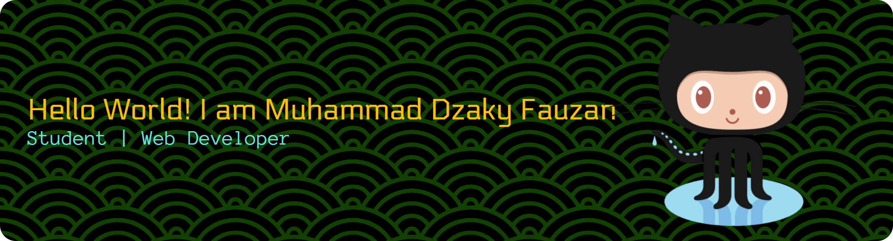

<h1 align="center">Hey 👋What's Up?</h1>

- 🔭 I’m currently a student at [**Polytechnic IDN**](https://idn.ac.id/)
- 🌱 I’m currently learning **Laravel** Framework

#### Skills

#### Hosting & Cloud

#### Frameworks & Library

#### Connect With Me

 

#### Github Stats
###

  
  
  
  

###

<picture>
  <source media="(prefers-color-scheme: dark)" srcset="https://raw.githubusercontent.com/kypau-project/kypau-project/output/pacman-contribution-graph-dark.svg">
  <source media="(prefers-color-scheme: light)" srcset="https://raw.githubusercontent.com/kypau-project/kypau-project/output/pacman-contribution-graph.svg">
  
</picture>

###

###

